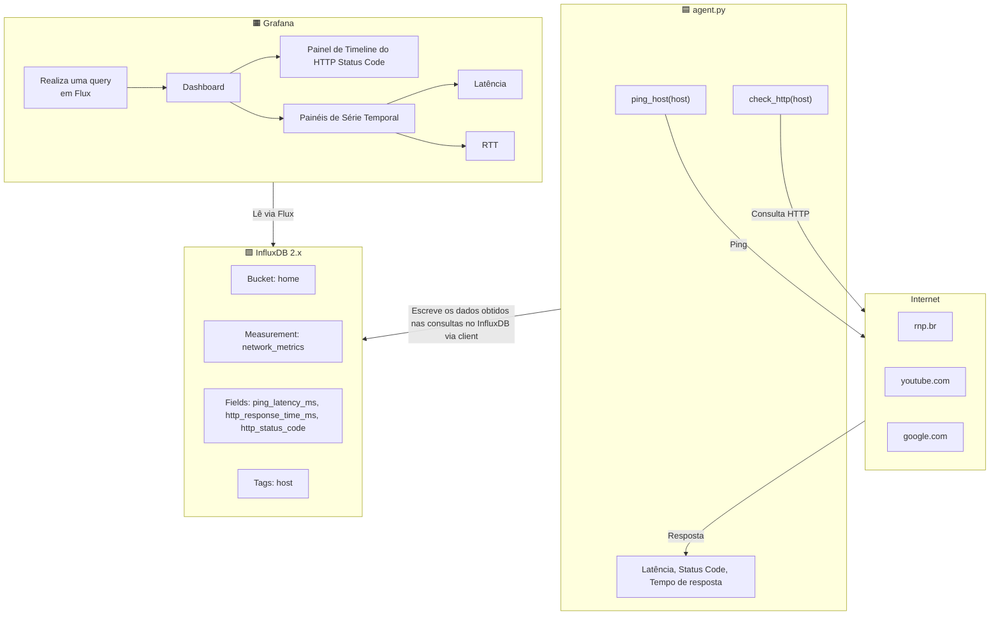

# Entrevista-RNP - Questão 1
Este repositório armazena a resolução das questões da entrevista para DevOps da RNP.
O código aqui presente implementa a resolução para a questão 1, que solicita uma aplicação dockerizada que realize uma série de consultas de latência, tempo de resposta e status HTTP da resposta. O código em questão foi elaborado em um sistema Linux Ubuntu 22.04.

## Estrutura básica do código 
A estrutura básica do código consiste das seguintes partes:

    agent/
        agent.py            --> script principal de consulta
        Dockerfile          --> montagem do container
        requirements.txt    --> requisitos da aplicação
    secrets/                --> credenciais das plataformas
    grafana/                --> configurações customizadas de consulta e dashboard
    docker-compose.yml      --> preparação de ambiente e containers

Ao executar o docker compose, serão criados três containers executando: 
- InfluxDB (banco de dados escolhido)
- Grafana (para realizar a montagem dos dashboards)
- um agente python (quem realiza os pings e envia os dados ao InfluxDB)

Abaixo pode-se observar um fluxograma básico do funcionamento do código. Nele, **agent.py**, realiza as consultas aos sites e grava os resultados relevantes no **InfluxDB**. Esses dados então são consultados pelo **Grafana** para exibir o Dashboard.

## Execução 
### Prerequisitos:
Ter o Docker instalado e Docker Compose
### Subindo os serviços
Primeiramente clone o repositório e acesse o diretório do projeto:

    git clone https://github.com/AlvaroLuz/entrevista-rnp
    cd entrevista-rnp

e inicialize o diretório *secrets/* com o *init_secrets.sh*

    sudo chmod +x init_secrets.sh #garantindo a permissao de execucao se nao houver
    sudo ./init_secrets.sh

após isso, simplesmente suba os containers
    
    docker compose up -d

## Visualizando o Dashboard no Grafana
Após subir os containers, é esperado que o Grafana esteja rodando na porta 3000, portanto é apenas necessário acessar o link http://localhost:3000
    
**O perfil de Administrador do Grafana já estará configurado**, assim, as credenciais são definidas automaticamente e a senha é armazenada na pasta secrets usando o script de inicialização. 

> **username padrão: admin**

**para visualizar a senha**, apenas execute dentro da pasta do projeto:

    cat ./secrets/grafana_admin_password

uma vez logado no Grafana, entre na aba de **Dashboards**, nela estará configurado um Dashboard por padrão exibindo os dados coletados e armazenados no InfluxDB.

**OBS: na primeira vez que o Dashboard for carregado, será necessário clicar em editar e dar refresh em cada uma das consultas individualmente, devido a um bug do Grafana.**