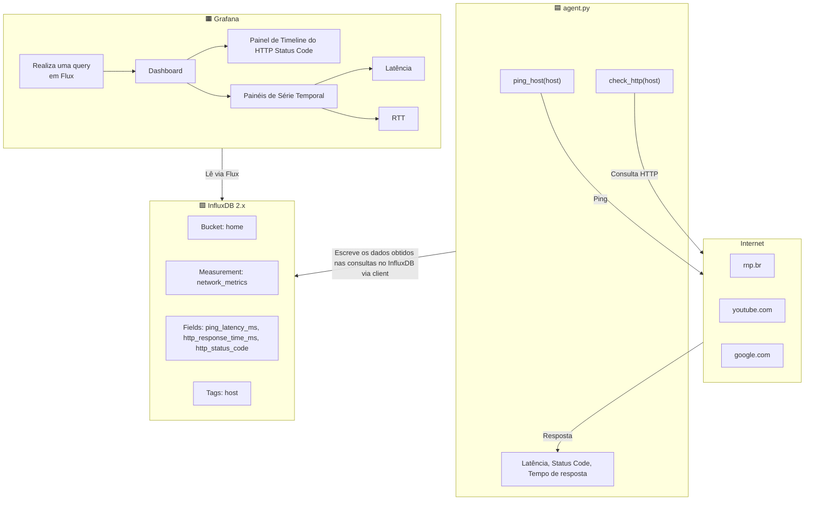

# Prova Prática RNP
Este repositório contém a resolução das questões da prova prática de DevOps da RNP.

# Questão 1 - Opção 1 de Implementação  

O código aqui presente implementa a resolução para a questão 1, que solicita uma aplicação dockerizada que realize uma série de consultas de latência, tempo de resposta e status HTTP da resposta. O código em questão foi elaborado em um sistema Linux Ubuntu 22.04.

## Estrutura básica do código 
A estrutura básica do código consiste das seguintes partes:

    agent/
        agent.py            --> script principal de consulta
        Dockerfile          --> montagem do container
        requirements.txt    --> requisitos da aplicação
    secrets/                --> credenciais das plataformas
    grafana/                --> configurações customizadas de consulta e dashboard
    docker-compose.yml      --> preparação de ambiente e containers

Ao executar o docker compose, serão criados três containers executando: 
- InfluxDB (banco de dados escolhido)
- Grafana (para realizar a montagem dos dashboards)
- um agente python (quem realiza os pings e envia os dados ao InfluxDB)

Abaixo pode-se observar um fluxograma básico do funcionamento do código. Nele, **agent.py**, realiza as consultas aos sites e grava os resultados relevantes no **InfluxDB**. Esses dados então são consultados pelo **Grafana** para exibir o Dashboard.

## Execução 
### Prerequisitos:
Ter o Docker instalado e Docker Compose
### Subindo os serviços
Primeiramente clone o repositório e acesse o diretório do projeto:

    git clone https://github.com/AlvaroLuz/entrevista-rnp
    cd entrevista-rnp

e inicialize o diretório *secrets/* com o *init_secrets.sh*

    sudo chmod +x init_secrets.sh #garantindo a permissao de execucao se nao houver
    sudo ./init_secrets.sh

após isso, simplesmente suba os containers
    
    docker compose up -d

## Visualizando o Dashboard no Grafana
Após subir os containers, é esperado que o Grafana esteja rodando na porta 3000, portanto é apenas necessário acessar o link http://localhost:3000
    
**O perfil de Administrador do Grafana já estará configurado**, assim, as credenciais são definidas automaticamente e a senha é armazenada na pasta secrets usando o script de inicialização. 

> **username padrão: admin**

**para visualizar a senha**, apenas execute dentro da pasta do projeto:

    cat ./secrets/grafana_admin_password

uma vez logado no Grafana, entre na aba de **Dashboards**, nela estará configurado um Dashboard por padrão exibindo os dados coletados e armazenados no InfluxDB.

**OBS: na primeira vez que o Dashboard for carregado, será necessário clicar em editar e dar refresh em cada uma das consultas individualmente, devido a um bug do Grafana.**

# Questão 2 -  **Outros Projetos Relevantes**

Grande parte do meu trabalho em DevOps foi desenvolvido dentro da infraestrutura da instituição onde atuo atualmente, a Sala de Situação, um laboratório na UnB de pesquisas epidemiológicas, no qual atuo dentro da equipe de manutenção da infraestrutura de TI. Portanto muitos dos meus projetos envolvem plataformas de saúde, além disso, alguns repositórios não podem ser disponibilizados por conter dados sigilosos ou por conterem informações da nossa infraestrutura. Ainda assim, descrevo abaixo os principais tipos de projetos que desenvolvi e aponto repositórios públicos que representam de forma aproximada minha experiência.

---

### **Automação e Integração de Pipelines de Dados**

Tenho trabalhado extensivamente com automação de pipelines em Python, principalmente para integração entre APIs e coleta de dados em larga escala. Entre os projetos que desenvolvi internamente estão:

* Coleta e envio automatizado de dados do**Odoo** para o **Nextcloud**, usados por dashboards do Power BI.
* Pipelines de extração e tratamento de bases públicas de saúde (**SINAN, SIA, CNES**).
* Extração periódica de dados do **Metabase** da plataforma Guardiões da Saúde.

Os coletores desenvolvidos estão atualmente sendo adaptados para operarem de forma dockerizada, de forma a facilitar o trabalho de setup. O código dessas implementações pode ser visto em:
    
    https://github.com/AlvaroLuz/repositorios-sds

---

### **Integração com Go.Data**

Desenvolvi uma integração em Python que processa dados nominais do **SINAN** (Sistema de Informação de Agravos de Notificação) e envia automaticamente para a plataforma **GoData** via **API**. O projeto envolve tratamento de dados, normalização, logs estruturados. O código fonte desse projeto pode ser visto em: 

    https://github.com/AlvaroLuz/sinan-godata-adapter

---

### **Implementação de sistema de backups Bacula e automação de instalação para novos Hosts**

Implementei o sistema de backups utilizado pela instiução usando **Bacula**, também implementei uma interface visual usando Bacularis para o monitoramento de nossos backups. Ainda, elaborei scripts shell que automatizam a instalação e configuração do cliente em novas máquinas. Esse trabalho reduziu significativamente o esforço manual para subir novos servidores e recuperar ambientes em casos de catástrofe.

---

### **Monitoramento com Zabbix**

Sou responsável por parte da operação do nosso ambiente de monitoramento baseado em **Zabbix**, incluindo:

* Configuração de hosts e templates
* Criação de gráficos de monitoramento das atividades dos hosts ( Memória, uso de CPU, Status do host) e gatilhos
* Monitoramento do espaço para backup em nossa NAS e status dos clientes Bacula
* Ajustes em alertas via Telegram e ações
* Inclusão contínua de novos serviços e máquinas

Esse trabalho reforça experiência prática com observabilidade e operação contínua.

---

### **Conclusão**

Como expliquei anteriormente, muitos dos projetos envolvem dados sensíveis e infraestrutura interna, não posso disponibilizar os repositórios diretamente. No entanto, os exemplos acima refletem as áreas onde atuo ativamente: automação, monitoramento e integração entre sistemas.

